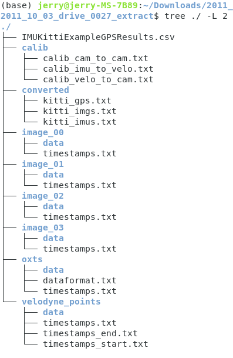
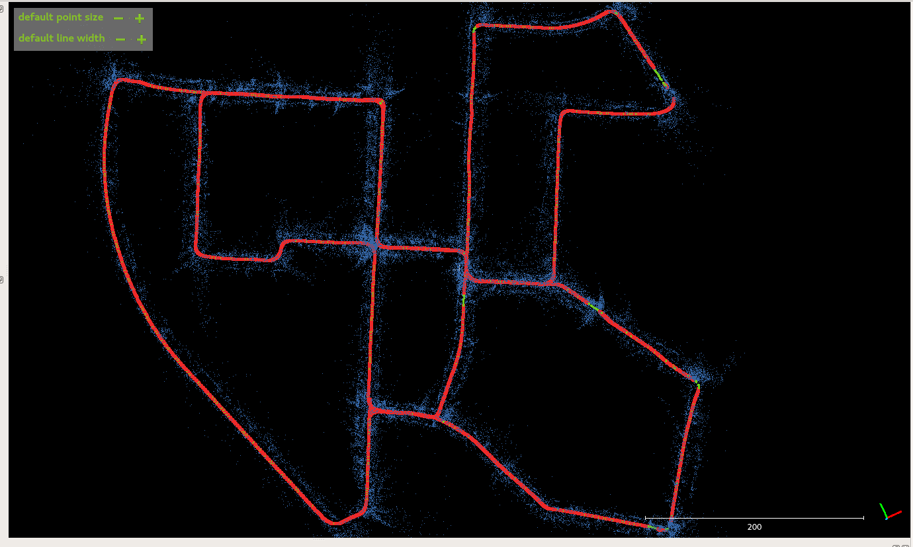
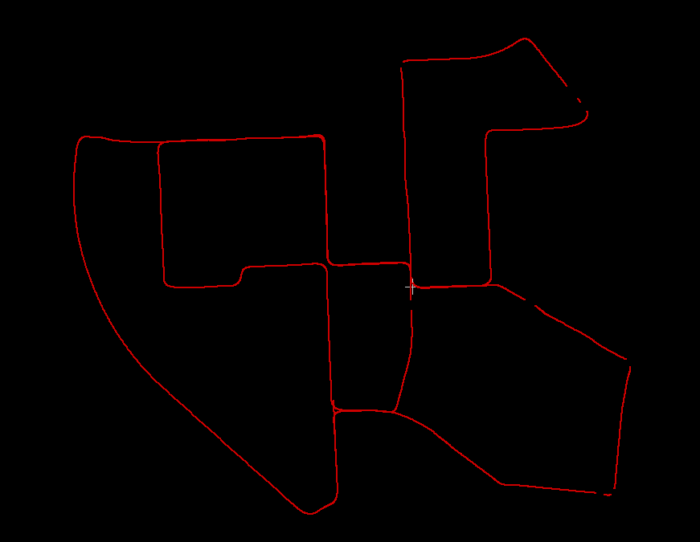
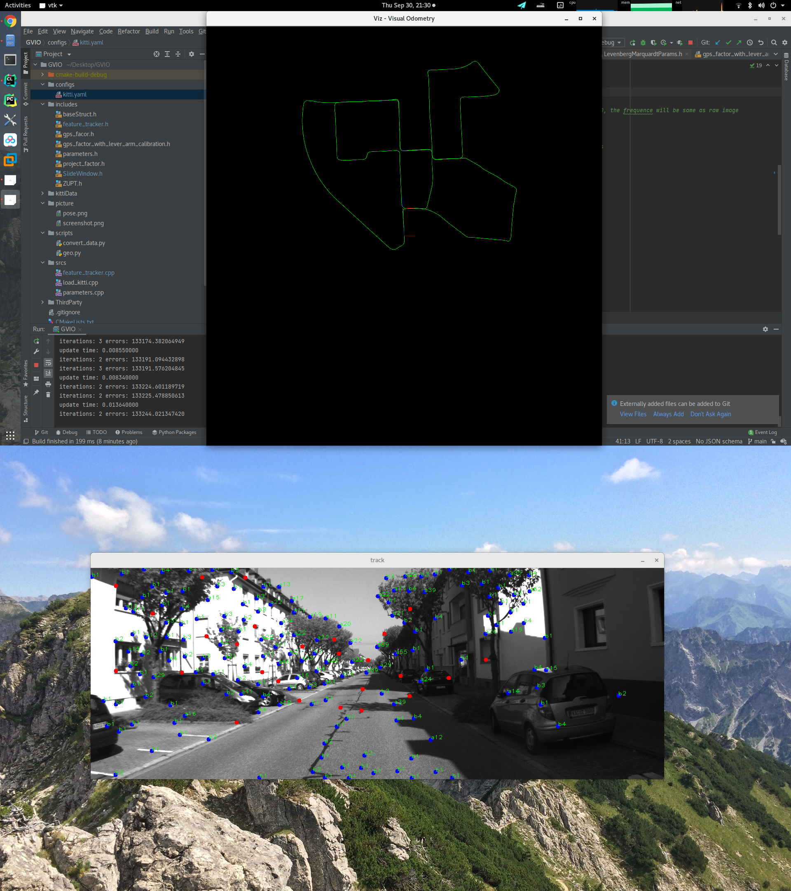

Tightly Coupled GNSS-Visual-Inertial Positioning System Using GTSAM

这是一个实验性质的紧耦合GNSS、惯导、视觉的定位系统。

目的是设计一个融合定位系统，多传感器相互协同。多传感器工作正常时相互融合提高精度，有传感器挂掉其他传感器及时顶上维持轨迹递推。

外部依赖库包括两个： 
GTSAM 我用的是4.0.0 最新版本的应该也OK
OPENCV 3.2.0

#具体使用方法：

把下载的KITTI数据组织成如下形式：

将一级目录绝对路径输入script/convert_data.py然后执行得到解析数据。

配置GVIO.cpp以对应数据路径开跑。

轨迹和对应的特征点，图中红色部分为KITTI RTK信号，缺漏部分即没有IMU也没有RTK信号，单纯依靠VO进行推演。

给代码加上了轨迹可视化的模块
